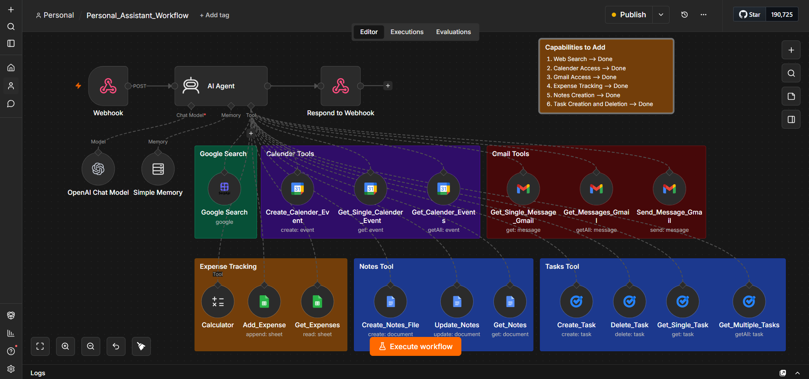

# 🤝 N8N Personal Assistant

A conversational AI-powered personal assistant built with **Streamlit** and **n8n** — chat to manage your calendar, emails, tasks, notes, and expenses.



---

## ✨ Features

| | Tool | Capabilities |
|---|---|---|
| 🔍 | **Web Search** | Answer questions using real-time Google Search |
| 📅 | **Google Calendar** | Create and fetch events |
| 📧 | **Gmail** | Read, summarize, and send emails |
| 💰 | **Expense Tracking** | Log expenses to Google Sheets, run calculations |
| 📝 | **Notes** | Create, update, and retrieve Google Docs notes |
| ✅ | **Tasks** | Create, fetch, and delete Google Tasks |

---

## 🏗️ How It Works

```
Streamlit UI  →  n8n Webhook  →  AI Agent (OpenAI + Simple Memory)  →  Tools  →  Response
```

---

## 🚀 Setup

### Prerequisites
- Python 3.11+, [uv](https://github.com/astral-sh/uv)
- n8n instance (local or cloud)
- OpenAI API key + Google OAuth credentials configured in n8n

### Install & Run

```bash
git clone https://github.com/your-username/n8n-personal-assistant.git
cd n8n-personal-assistant
uv sync
streamlit run app.py
```

### Configure Webhook

In `app.py`, replace the webhook URL with your own:

```python
response = requests.post(
    "http://localhost:5678/webhook/YOUR-WEBHOOK-ID",
    json={"message": user_message}
)
```

> **Tip:** Use `python test_webhook.py` to verify the webhook before launching the UI. Note that `test_webhook.py` uses the `/webhook-test/` URL — switch to `/webhook/` in `app.py` after publishing.

---

## 📁 Structure

```
n8n-personal-assistant/
├── assets/
│   └── n8n_workflow.png
├── app.py
├── test_webhook.py
├── pyproject.toml
└── README.md
```
